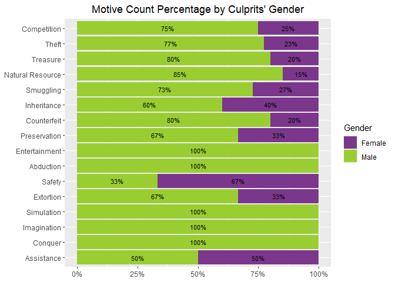
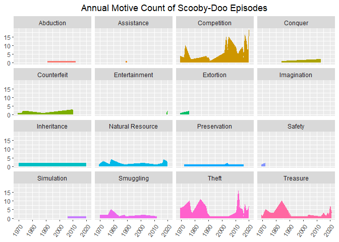
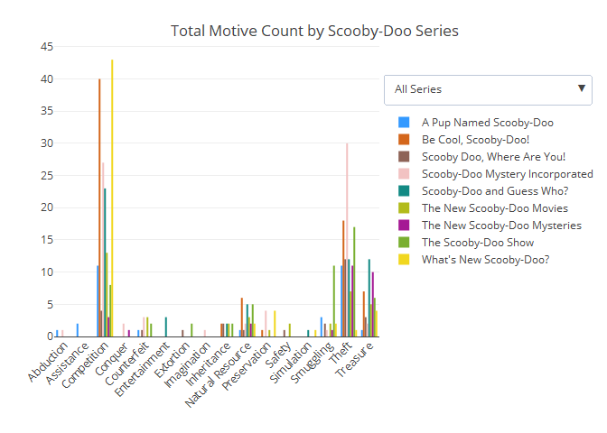

Scooby Doo Villain Motive Analysis
================
Leopoldine Mirtil

## Source Data

The data used in this project was uploaded by the user Plummye on
[Kaggle.com](https://www.kaggle.com/datasets/williamschooleman/scoobydoo-complete?select=Scooby-Doo+Complete+-+Episode+List+-+Update+9+15+21.csv#).
It contains information on all Scooby-Doo episodes, movies and specials
as of 9/15/2021. The data has 75 columns covering numerous variables
including show/movie information, monster information, culprit
information, motives, character appearances, and gags(jinkies, zoinks,
lost glasses, traps set, etc).

## Objective

I was watching ‘Scooby-Doo: Where Are You?’ just as the culprit was
being unmasked. This caused me to muse on the motives of most Scooby-Doo
villains, especially considering how far they go to achieve their goal.
In this analysis, I will examine the motives of the villains from
several Scooby-Doo tv shows, featuring the classic gang of Fred, Daphne,
Velma, Shaggy and Scooby-Doo.

### Task

1.  Determine the top and bottom five overall motives from all series
2.  Examine the motives between male and female culprits
3.  Identify the top three motives for each show
4.  Identify the top three motives per environment and year

### Step 1: Get Data

#### Load Library

``` r
#data manipulation
library(tidyr)
library(tidyverse)
library(dplyr)
library(lubridate)

#documentation & markdown
library(knitr)

#creating charts & interactive plots 
library(ggplot2)
library(plotly)
library(webshot) #screenshot of plotly chart in markdown
```

#### Import Data

``` r
df <- read.csv('Scooby-Doo Completed.csv')
```

### Step 2: Clean & Modify Data

#### Select and Inspect Data

``` r
#copy data 
sc_df <- df

#select columns
sc_df <- sc_df[,c(2,8,10,42,48,50)]

#view column names 
colnames(sc_df)
```

    ## [1] "series.name"     "date.aired"      "format"          "setting.terrain"
    ## [5] "culprit.gender"  "motive"

#### Check for Missing/NA values

``` r
sapply(sc_df, function(x) sum(is.na(x)))
```

    ##     series.name      date.aired          format setting.terrain  culprit.gender 
    ##               0               0               0               0               0 
    ##          motive 
    ##               0

#### Check for Empty/Blank Values

``` r
sapply(sc_df, function(x) sum(x==""))
```

    ##     series.name      date.aired          format setting.terrain  culprit.gender 
    ##               0               0               0               0               0 
    ##          motive 
    ##               0

#### Filter and Modify Data

``` r
#copy data just in case
scoob <- sc_df

#filter data to: include only the tv shows
                #include only shows with the full Scooby-Doo 
                #remove NULL values from motive column
scoob <- scoob %>%
  filter((format == "TV Series") | (format == "TV Series (segmented)")) %>%
  filter((series.name != "Lego") & (series.name  != "Warner Home Video") &
         (series.name != "Shaggy & Scooby-Doo Get a Clue!") & (series.name  != "Night of the Living Doo") &
         (series.name != "The Scooby-Doo Project") & (series.name  != "The 13 Ghosts of Scooby-Doo") &
         (series.name != "The New Scooby and Scrappy Doo Show") & (series.name  != "Scooby-Doo and Scrappy-Doo (second series)") &
         (series.name != "Scooby-Doo and Scrappy-Doo (first series)") & (series.name  != "Laff-a-Lympics")) %>%
  filter(motive != "NULL")

#change data type 
scoob$date.aired <- as.Date(scoob$date.aired)

#drop format column
scoob <- scoob[-c(3)]

#split column values
scoob <- scoob %>%
  separate_rows(culprit.gender, sep = ",") %>%
  mutate(culprit.gender=trimws(culprit.gender))

#rename columns
scoob <- rename(scoob, series=series.name, environment=setting.terrain)
```

#### View Data

``` r
str(scoob)
```

    ## tibble [439 × 5] (S3: tbl_df/tbl/data.frame)
    ##  $ series        : chr [1:439] "Scooby Doo, Where Are You!" "Scooby Doo, Where Are You!" "Scooby Doo, Where Are You!" "Scooby Doo, Where Are You!" ...
    ##  $ date.aired    : Date[1:439], format: "1969-09-13" "1969-09-20" ...
    ##  $ environment   : chr [1:439] "Urban" "Coast" "Island" "Cave" ...
    ##  $ culprit.gender: chr [1:439] "Male" "Male" "Male" "Male" ...
    ##  $ motive        : chr [1:439] "Theft" "Theft" "Treasure" "Natural Resource" ...

    ## Warning in rm(df, sc_df, scd): object 'scd' not found

### Step 3: Analyze Data

``` r
summary(scoob)
```

    ##     series            date.aired         environment        culprit.gender    
    ##  Length:439         Min.   :1969-09-13   Length:439         Length:439        
    ##  Class :character   1st Qu.:1978-11-07   Class :character   Class :character  
    ##  Mode  :character   Median :2005-02-11   Mode  :character   Mode  :character  
    ##                     Mean   :1999-08-04                                        
    ##                     3rd Qu.:2016-03-01                                        
    ##                     Max.   :2021-02-25                                        
    ##     motive         
    ##  Length:439        
    ##  Class :character  
    ##  Mode  :character  
    ##                    
    ##                    
    ## 

#### Top & Bottom 5 Motives from All Episodes

``` r
scoob %>%
  group_by(motive) %>%
  summarise(count=n()) %>%
  arrange(desc(count)) %>%
  slice(unique(c(1:5, n() - 4:0))) 
```

    ## # A tibble: 10 × 2
    ##    motive           count
    ##    <chr>            <int>
    ##  1 Competition        172
    ##  2 Theft              119
    ##  3 Treasure            50
    ##  4 Natural Resource    27
    ##  5 Smuggling           22
    ##  6 Safety               3
    ##  7 Abduction            2
    ##  8 Assistance           2
    ##  9 Simulation           2
    ## 10 Imagination          1

#### Top 3 Motives by Series

``` r
scoob %>%
  group_by(series, motive) %>%
  reframe(count=n()) %>%
  arrange(series, desc(count)) %>%
  group_by(series) %>%
  slice(1:3)
```

    ## # A tibble: 27 × 3
    ## # Groups:   series [9]
    ##    series                          motive      count
    ##    <chr>                           <chr>       <int>
    ##  1 A Pup Named Scooby-Doo          Competition    11
    ##  2 A Pup Named Scooby-Doo          Theft          11
    ##  3 A Pup Named Scooby-Doo          Smuggling       3
    ##  4 Be Cool, Scooby-Doo!            Competition    40
    ##  5 Be Cool, Scooby-Doo!            Theft          18
    ##  6 Be Cool, Scooby-Doo!            Treasure        7
    ##  7 Scooby Doo, Where Are You!      Theft          12
    ##  8 Scooby Doo, Where Are You!      Competition     4
    ##  9 Scooby Doo, Where Are You!      Treasure        3
    ## 10 Scooby-Doo Mystery Incorporated Theft          30
    ## # ℹ 17 more rows

#### Motive Count by Gender

``` r
scoob %>%
  group_by(culprit.gender, motive) %>%
  reframe(count=n()) %>%
  arrange(motive, desc(count)) %>%
  filter(culprit.gender != "NULL")
```

    ## # A tibble: 27 × 3
    ##    culprit.gender motive        count
    ##    <chr>          <chr>         <int>
    ##  1 Male           Abduction         2
    ##  2 Female         Assistance        1
    ##  3 Male           Assistance        1
    ##  4 Male           Competition     128
    ##  5 Female         Competition      43
    ##  6 Male           Conquer           1
    ##  7 Male           Counterfeit       8
    ##  8 Female         Counterfeit       2
    ##  9 Male           Entertainment     3
    ## 10 Male           Extortion         2
    ## # ℹ 17 more rows

#### Top 3 Motives by Environment

``` r
scoob %>%
  group_by(environment, motive) %>%
  reframe(count=n()) %>%
  arrange(environment, desc(count)) %>%
  group_by(environment) %>%
  slice(1:3)
```

    ## # A tibble: 38 × 3
    ## # Groups:   environment [14]
    ##    environment motive      count
    ##    <chr>       <chr>       <int>
    ##  1 Air         Competition     1
    ##  2 Cave        Treasure        6
    ##  3 Cave        Competition     1
    ##  4 Cave        Conquer         1
    ##  5 Coast       Smuggling       4
    ##  6 Coast       Competition     3
    ##  7 Coast       Counterfeit     2
    ##  8 Desert      Competition    12
    ##  9 Desert      Theft           4
    ## 10 Desert      Treasure        4
    ## # ℹ 28 more rows

#### Top 3 Motives by Year

``` r
scoob %>%
  mutate(aired.year=year(date.aired)) %>%
  group_by(aired.year, motive) %>%
  reframe(count=n()) %>%
  arrange(aired.year, desc(count)) %>%
  group_by(aired.year) %>%
  slice(1:3)
```

    ## # A tibble: 78 × 3
    ## # Groups:   aired.year [28]
    ##    aired.year motive      count
    ##         <dbl> <chr>       <int>
    ##  1       1969 Theft           6
    ##  2       1969 Competition     4
    ##  3       1969 Treasure        2
    ##  4       1970 Theft           6
    ##  5       1970 Inheritance     2
    ##  6       1970 Smuggling       2
    ##  7       1972 Theft           7
    ##  8       1972 Treasure        5
    ##  9       1972 Competition     3
    ## 10       1973 Competition    10
    ## # ℹ 68 more rows

### Step 4: Visualize Data

<!-- -->

<!-- -->

<!-- -->

<!-- -->
